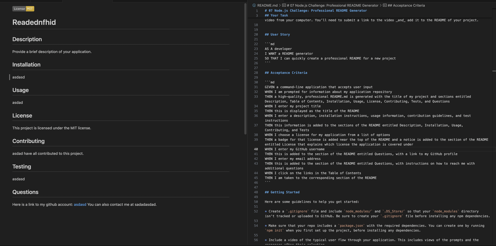

# README generator

## Website: 
[website](https://github.com/GP-Person/READMEgen)

## Description
Generates READMEs on the command line

## Table of Contents
- [Installation](#installation)
- [Usage](#usage)
- [Credits](#credits)
- [License](#license)
- [Features](#features)

- [Contact](#contact)

## Installation
inquirer, npm, and fs

## Usage
To generate README files

## Credits
GP

## License
MIT

## Features
Uses inquirer to ask for user input and saves a file with that data

## Contact
If there are any questions or concerns, I can be reached at:
##### [github: GP-Person](https://github.com/GP-Person)
##### [email: garrettapearson@gmail.com](mailto:garrettapearson@gmail.com)
